#### 愛知県

# 愛知県立みあい養護学校

- 建築主 / 愛知県
- 所在地 /〒444-0802 愛知県岡崎市美合町並松1-51
- 敷地面積 / 17,531㎡
- 建築面積 / 3,623㎡
- 延床面積 / 7,992㎡
- 構造・規模 / 鉄筋コンクリート造(一部 鉄骨造) 3階建
- 施工期間 /平成19年8月~平成21年3月10日

| 知的障害 |         |        |
|------|---------|--------|
| 学部   | 児童生徒数   | クラス数   |
| 小学部  | 59 (9)  | 14 (3) |
| 中学部  | 42 (2)  | 9 (1)  |
| 高等部  | 107 (5) | 17 (3) |
| 合計   | 208     | _      |

- ※平成24年2月現在
- ※( )内は、重複障害学級の児童生徒数と クラス数(内数)

#### 計画に見られる指針改訂のポイント

- 学習·生活空間の充実
- 一人一人の教育的ニーズへの対応
- 特別支援学校の幼児児童生徒数の増加への 対応
- 情報環境の充実

## 教職員の指導における創造性が 膨らむ、多様に使える空間の整備

愛知県内10校目の知的障害に対応する県立特別 支援学校として平成21年4月に開校した。広くゆった りとした空間に壁一面の窓ガラスを配したプレイルーム は、明るく開放的であり、児童生徒の創造性を育む教 育が行われている。

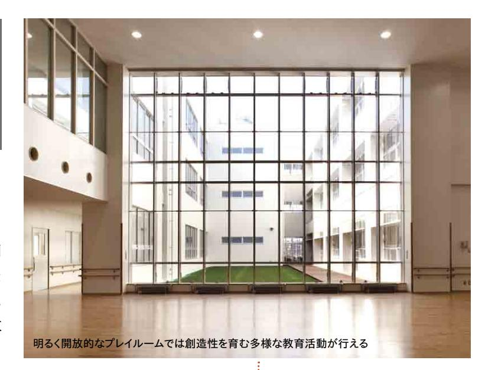

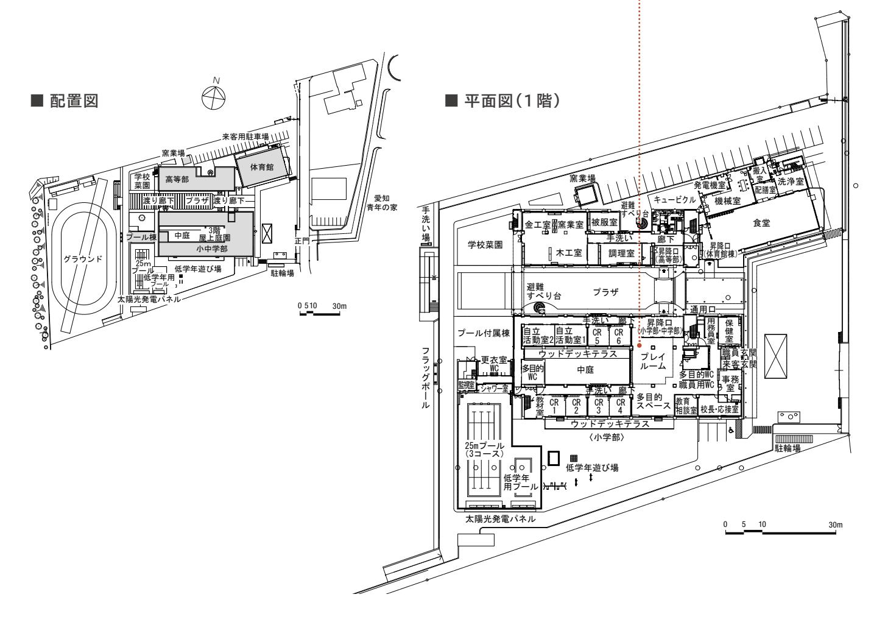

#### **学習・生活空間の充実**

#### ▲ ▲ 多様な学習活動に対応する空間

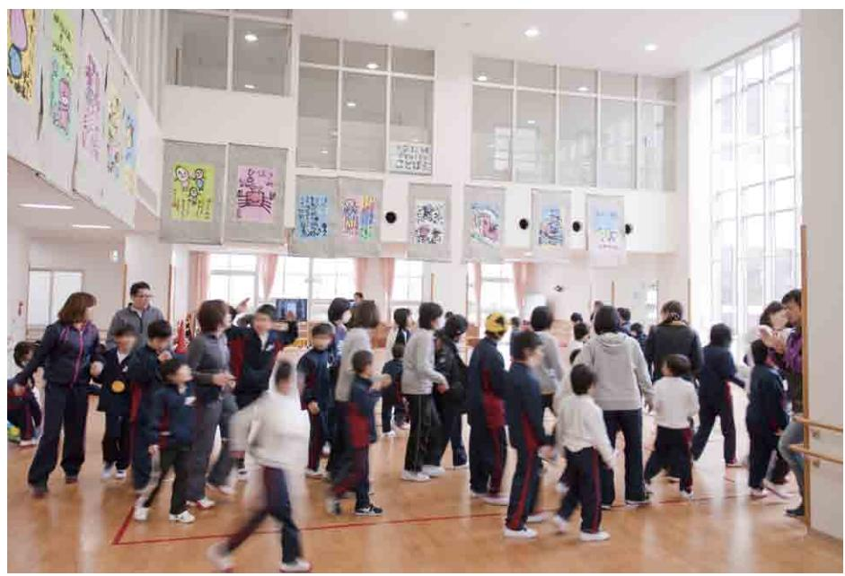

**❶**プレイルームは、運動、集会、作品製作など、多様な学習活動を考慮して広い面積を確保している。

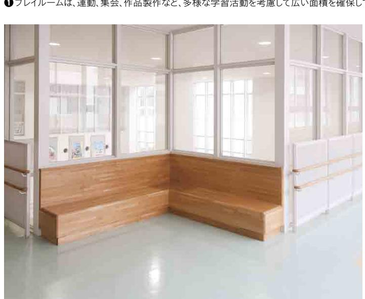

**❸**廊下にあるコーナーベンチ。次の活動までの待ち時間や休憩の際に使用されるほか、児 童生徒同士の交流の場となる。

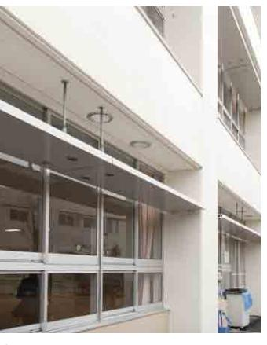

**❷**南側の窓には、直射日光を遮り、反射さ せた光を天井面に拡散させるライトシェ ルフ(ひさし)が取り付けられている。

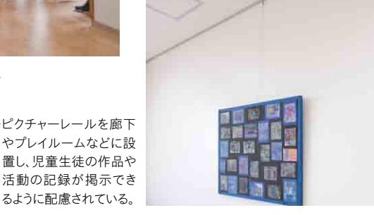

**❹**ピクチャーレールを廊下 やプレイルームなどに設 置し、児童生徒の作品や 活動の記録が掲示でき

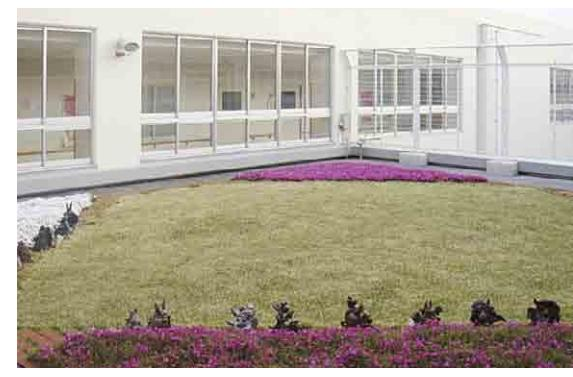

**❺**屋上庭園は、児童生徒が屋外に出てくつろげる空間になっている。 自動灌水装置の導入により、管理負担を軽減している。上部を折り 返したフェンスを設置し、安全面にも配慮している。

#### **施設全体の特徴**

光の降り注ぐ広く高い窓、開放的な 吹き抜け、採光に配慮した明るい校舎 で、児童生徒は活動的な生活を送って いる。児童生徒が思う存分に体を動か せる空間として、プレイルームや多目的ス ペースが整備されている。自主性を尊 重し、個別の課題の克服を目指す教育 に重点を置き、児童生徒の能力や状況 に応じた教育活動が行われている。

### **多様な学習活動に 対応する空間**

二層吹き抜けのプレイルームでは、運 動、集会、作品製作など、多様な学習活 動が行われる。中庭側から差し込む明 るい光の中、児童生徒の創造性と交流 を育む教育活動が行われている(**❶**)。

教室等の南側の窓には直射日光を 遮るとともに、反射させた光を天井面に 拡散させ、教室内を明るくするライトシェ ルフ(ひさし)が取り付けられている(**❷**)。 廊下にはコーナーベンチが設置されて いる。次の活動までの待ち時間や、休 み時間に児童生徒同士が交流する場 所となっている(**❸**)。校内の随所に、 児童生徒の作品や活動の記録を掲示 するためのピクチャーレールが整備され ている。自分の作品が掲示されること で児童生徒の意欲の向上につながっ ている(**❹**)。屋上に整備された庭園は、 児童生徒が休み時間などに気軽にくつ

#### **一人一人の教育的ニーズへの対応**

#### ▲ ▲ 空間に役割を与えることで、見通しが持ちやすい普通教室

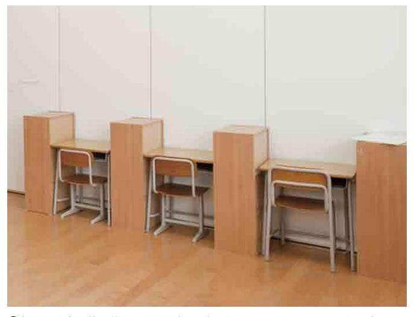

**❻**机の間を家具等で仕切ることで、個人学習を行うスペースであることを明確にして、 児童生徒が見通しを持って円滑に活動できるように工夫している。

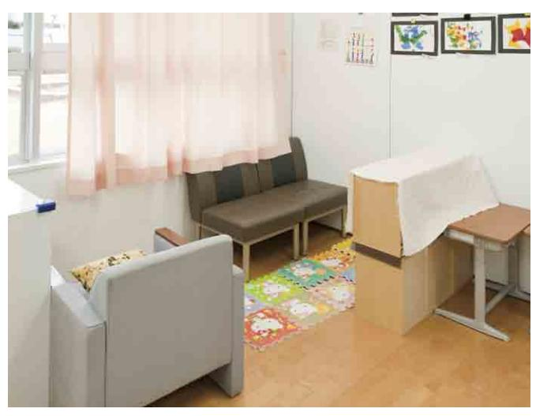

**❼**窓側の一角を家具等で仕切り、ソファやマットを設置することで、休憩のための空間 であることを明確にしている。

#### **特別支援学校の幼児児童生徒数の増加への対応**

#### ▲ ▲ 将来の教室増に配慮した施設の設計

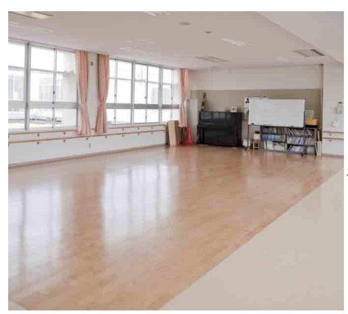

**❽**多目的スペースは、普通教室の2教室分の広さを確保し、将来、児童生徒数が増 加した場合の転用に配慮している。床は普通教室と同じ素材にしている。

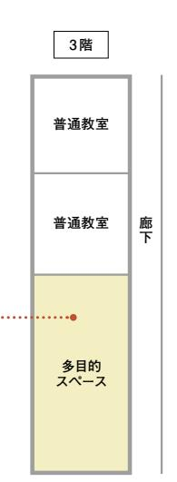

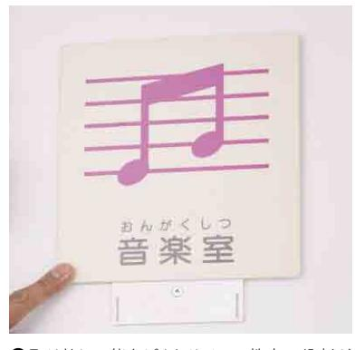

**❾**取り外し可能なピクトサイン。教室の役割が 変わった際に容易に取り外し、変更が可能で ある。

ろげる場所となっている。自動灌水装置 を装備することで、管理負担を軽減して いる。上部を折り返したフェンスを設置し、 安全面にも配慮している(**❺**)。

### **活動の見通しが持ちやすい 普通教室**

児童生徒の課題は一人一人多様であ

り、進度も取り組む内容も一人一人異な ることから、教室内は可動の家具等を用 いて、個別のニーズに対応するための "構 造化 "が行われている。例えば、机の間 を家具等で仕切ることで、個人学習を行 うスペースであることを明確にして、児童 生徒が見通しを持って円滑に活動できる ように工夫している(**❻**)。また、窓側の一 角を家具等で仕切り、ソファやマットを設

置することで、休憩のための空間であるこ とを明確にしている(**❼**)。

### **将来の教室増にも 対応できる施設整備**

近年、知的障害の特別支援学校では 児童生徒数が増加傾向にあることから、 多目的スペースは将来普通教室への転

#### **情報環境の充実**

#### ▲ ▲ 校内のどこでも使用可能なICT環境

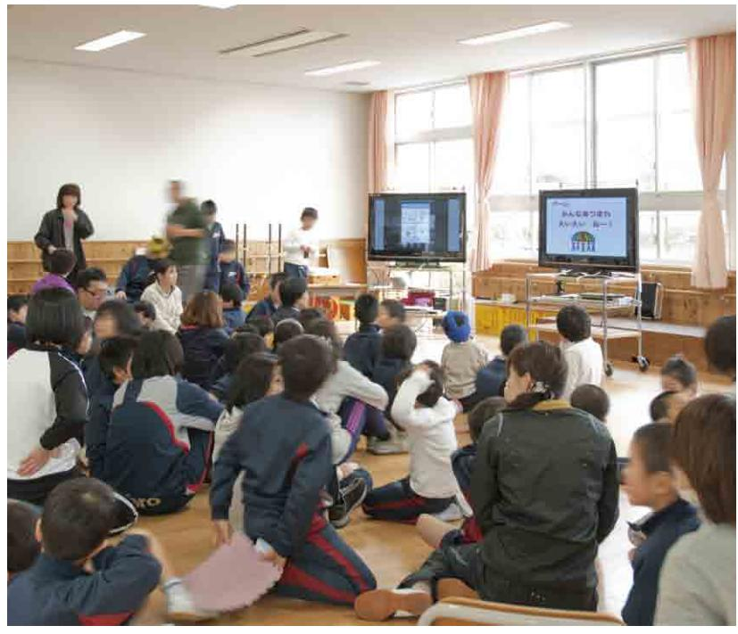

多様な学習が行える多目的スペースでの集会の様子。可搬型のICT機器により、視覚的に情報を補い ながら活動の見通しを立てやすくしている。

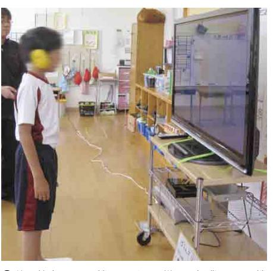

普通教室でのICT機器の活用の様子。授業でのICT機 器の活用は児童生徒の興味・関心を高め、主体的な活 動を促す効果を期待している。

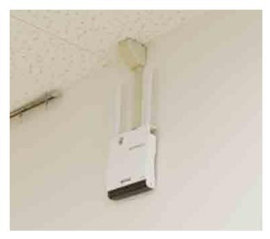

校内ネットワークは無線LANにより構築され ている。無線 LANアクセスポイントは廊下の 壁に取り付けてある。

用の可能性を考慮し、床の素材を普通 教室と同じ素材にしている(**❽**)。また、 将来の教室変更に備えて、教室表示の ピクトサインは取り外し可能なものとして いる(**❾**)。

### **校内ネットワークの整備等に よる情報環境の充実**

無線LANと、移動可能な情報端末 や大型提示装置を整備し、いつでもど こでも校内ネットワークを使用できる環 境を構築している()。集会などでの

一斉活動では、大型提示装置に課題を 提示することで、活動の見通しを立てや すくしている()。普通教室での個別 活動などでは、ICT機器の活用により 児童生徒の興味・関心を高め、主体的 な活動を促している()。

プレイルームや多目的スペースなど多様に使える部屋が 多数あるので、教職員は今まで他の学校では実行できな かった教育活動を実践できるようになったと喜んでいます。

多目的スペースは地域の方々と共に作品製作を行うなど、 地域住民との交流の場としても活かされています。また自 立活動に力を入れており、教室では可動間仕切りや家具な どを使用して普通教室内の構造化等を行い、児童生徒の 課題解決を支援しています。

#### **学校から 検討委員会から**

児童生徒が安心して、のびのびと過ごせるよう考慮し て、明るく開放的なプレイルームなどが整備されている。

また、計画段階から、将来の児童生徒数増に備えて 多目的スペースや倉庫の広さを考慮するなど、先を見 据えた計画も評価できる。ただし、多目的スペース等 は多様な活動に必要な空間であるため、その重要性に ついても考慮しながら、今後の児童生徒の増加に対応 していく必要がある。