## 愛知県愛知県立みあい養護学校

■ 建築主愛知県

■ 所在地〒 444-0802 愛知県岡崎市美合町並松1-51

■敷地面積17,531

■ 建築面積 3,623

■ 延床面積7,992

■ 構造·規模鉄筋コンクリート造(一部 鉄骨造)3階建

<table><tr><td rowspan=1 colspan=3>知的障害</td></tr><tr><td rowspan=1 colspan=1>学部</td><td rowspan=1 colspan=1>児童生徒数</td><td rowspan=1 colspan=1>クラス数</td></tr><tr><td rowspan=1 colspan=1>小学部</td><td rowspan=1 colspan=1>59(9)</td><td rowspan=1 colspan=1>14(3)</td></tr><tr><td rowspan=1 colspan=1>中学部</td><td rowspan=1 colspan=1>42(2)</td><td rowspan=1 colspan=1>9(1)</td></tr><tr><td rowspan=1 colspan=1>高等部</td><td rowspan=1 colspan=1>107(5)</td><td rowspan=1 colspan=1>17(3)</td></tr><tr><td rowspan=1 colspan=1>合計</td><td rowspan=1 colspan=1>208</td><td rowspan=1 colspan=1>-</td></tr></table>

■ 施工期間平成19年8月\~平成21年3月10日

平成24年2月現在

()内は、重複障害学級の児童生徒数とクラス数(内数)

## 計画に見られる指針改訂のポイント

■ 学習·生活空間の充実

■一人一人の教育的ニ一ズへの対応

特別支援学校の幼児児童生徒数の増加への対応

情報環境の充実

## 教職員の指導における創造性が膨らむ、多様に使える空間の整備

愛知県内10校目の知的障害に対応する県立特別支援学校として平成21年4月に開校した。広くゆったりとした空間に壁一面の窓ガラスを配したプレイルームは、明るく開放的であり、児童生徒の創造性を育む教育が行われている。

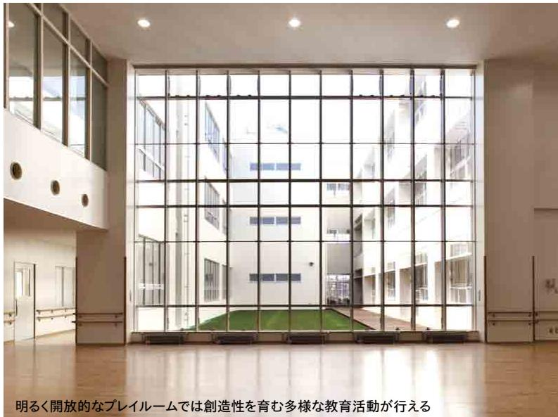

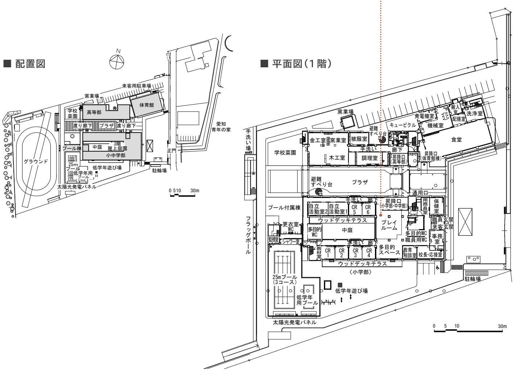

# 学習･生活空間の充実

# 多様な学習活動に対応する空間

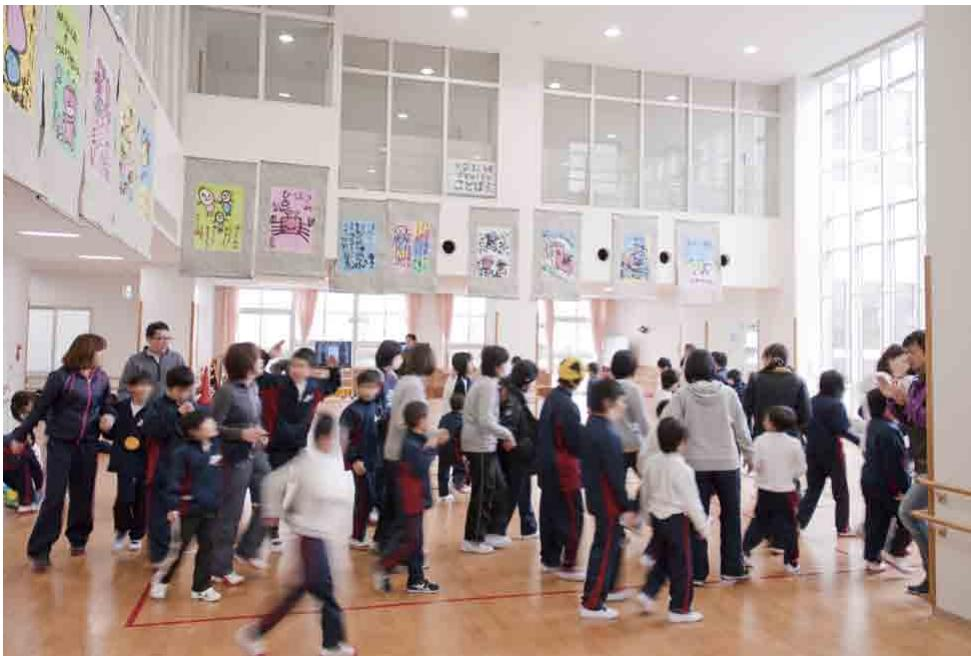  
0プレイルームは、運動、集会、作品製作など、多様な学習活動を考慮して広い面積を確保している。

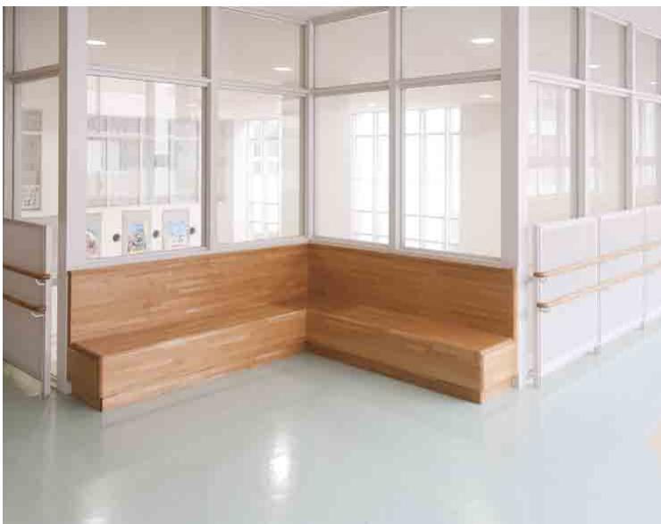  
③廊下にあるコーナーベンチ。次の活動までの待ち時間や休憩の際に使用されるほか、児童生徒同士の交流の場となる。

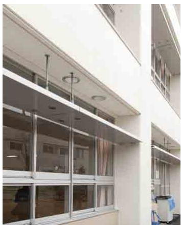  
©南側の窓には、直射日光を遮り、反射させた光を天井面に拡散させるライトシェルフ(ひさし)が取り付けられている。  
4ピクチャーレールを廊下やプレイルームなどに設置し、児童生徒の作品や活動の記録が掲示できるように配慮されている。

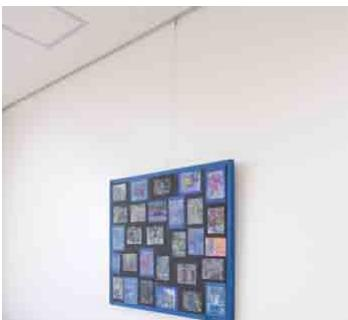

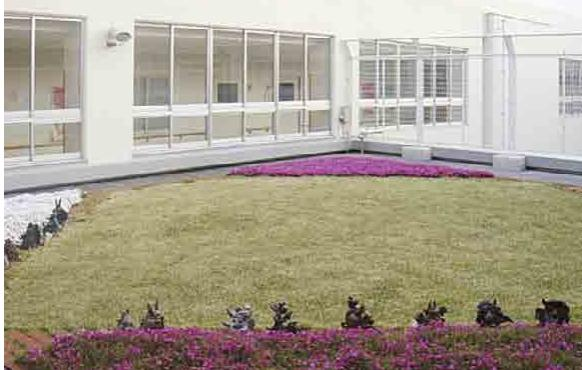  
6屋上庭園は、児童生徒が屋外に出てくつろげる空間になっている。自動灌水装置の導入により、管理負担を軽減している。上部を折り返したフェンスを設置し、安全面にも配慮している。

## 施設全体の特徴

光の降り注ぐ広く高い窓、開放的な吹き抜け、採光に配慮した明るい校舎で、児童生徒は活動的な生活を送っている。児童生徒が思う存分に体を動かせる空間として、プレイルームや多目的スペースが整備されている。自主性を尊重し、個別の課題の克服を目指す教育に重点を置き、児童生徒の能力や状況に応じた教育活動が行われている。

## 多様な学習活動に対応する空間

二層吹き抜けのプレイルームでは、運動、集会、作品製作など、多様な学習活動が行われる。中庭側から差し込む明るい光の中、児童生徒の創造性と交流を育む教育活動が行われている(①)。

教室等の南側の窓には直射日光を遮るとともに、反射させた光を天井面に拡散させ、教室内を明るくするライトシェルフ(ひさし)が取り付けられている(②)。廊下にはコーナーベンチが設置されている。次の活動までの待ち時間や、休み時間に児童生徒同土が交流する場所となっている(③)。校内の随所に、児童生徒の作品や活動の記録を掲示するためのピクチャーレールが整備されている。自分の作品が掲示されることで児童生徒の意欲の向上につながっている(④)。屋上に整備された庭園は、児童生徒が休み時間などに気軽にくつ

## 一人ー人の教育的ニーズへの対応

# 空間に役割を与えることで、見通しが持ちやすい普通教室

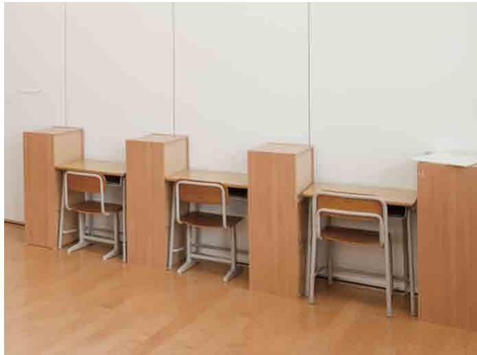  
6机の間を家具等で仕切ることで、個人学習を行うスペースであることを明確にして、児童生徒が見通しを持って円滑に活動できるように工夫している。

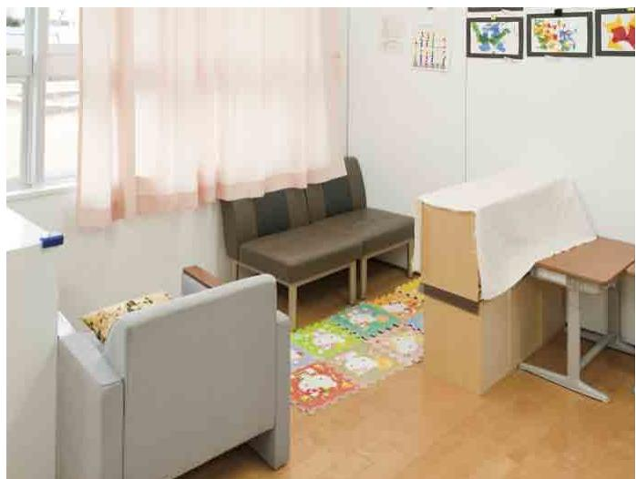  
0窓側の一角を家具等で仕切り、ソファやマットを設置することで、休憩のための空間であることを明確にしている。

## 特別支援学校の幼児児童生徒数の増加への対応

## 将来の教室増に配慮した施設の設計

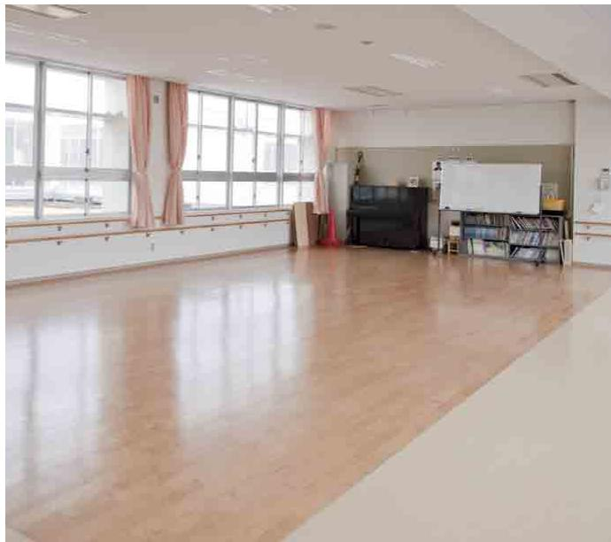

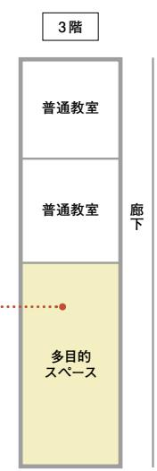

  
9取り外し可能なピクトサイン。教室の役割が変わった際に容易に取り外し、変更が可能である。  
8多目的スペースは、普通教室の2教室分の広さを確保し、将来、児童生徒数が増加した場合の転用に配慮している。床は普通教室と同じ素材にしている。

ろげる場所となっている。自動灌水装置を装備することで、管理負担を軽減している。上部を折り返したフェンスを設置し、安全面にも配慮している()。

## 活動の見通しが持ちやすい普通教室

児童生徒の課題は一人一人多様であり、進度も取り組む内容も一人一人異なることから、教室内は可動の家具等を用いて、個別のニーズに対応するための“構造化”が行われている。例えば、机の間を家具等で仕切ることで、個人学習を行うスペースであることを明確にして、児童生徒が見通しを持って円滑に活動できるように工夫している（6)。また、窓側の一角を家具等で仕切り、ソファやマットを設置することで、休憩のための空間であることを明確にしている(⑦)。

## 将来の教室増にも対応できる施設整備

近年、知的障害の特別支援学校では児童生徒数が増加傾向にあることから、多目的スペースは将来普通教室への転

# 校内のどこでも使用可能なICT環境

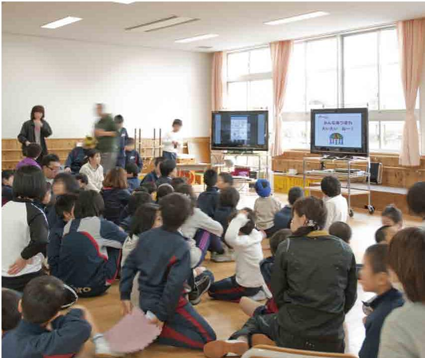  
多様な学習が行える多目的スペースでの集会の様子。可搬型のICT機器により、視覚的に情報を補いながら活動の見通しを立てやすくしている。

用の可能性を考慮し、床の素材を普通教室と同じ素材にしている(8)。また、将来の教室変更に備えて、教室表示のピクトサインは取り外し可能なものとしている()。

## 校内ネットワークの整備等による情報環境の充実

無線LANと、移動可能な情報端末や大型提示装置を整備し、いつでもどこでも校内ネットワークを使用できる環境を構築している()。集会などでの一斉活動では、大型提示装置に課題を提示することで、活動の見通しを立てやすくしている(⑩)。普通教室での個別活動などでは、ICT機器の活用により児童生徒の興味･関心を高め、主体的な活動を促している(①)。

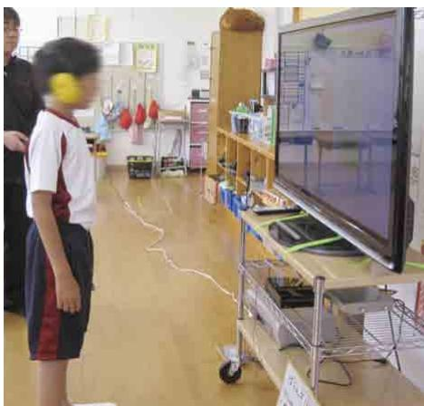  
①普通教室でのICT機器の活用の様子。授業でのICT機器の活用は児童生徒の興味·関心を高め、主体的な活動を促す効果を期待している。

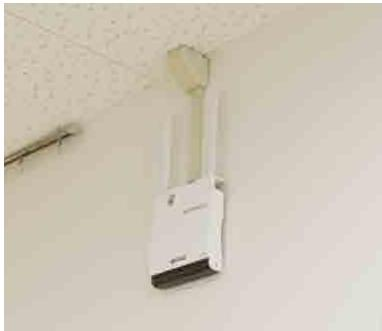  
校内ネットワークは無線LANにより構築されている。無線LANアクセスポイントは廊下の壁に取り付けてある。

## 学校から

プレイルームや多目的スペースなど多様に使える部屋が多数あるので、教職員は今まで他の学校では実行できなかった教育活動を実践できるようになったと喜んでいます。

多目的スペースは地域の方々と共に作品製作を行うなど、地域住民との交流の場としても活かされています。また自立活動に力を入れており、教室では可動間仕切りや家具などを使用して普通教室内の構造化等を行い、児童生徒の課題解決を支援しています。

## 検討委員会から

児童生徒が安心して、のびのびと過ごせるよう考慮して、明るく開放的なプレイルームなどが整備されている。

また、計画段階から、将来の児童生徒数増に備えて多目的スペースや倉庫の広さを考慮するなど、先を見据えた計画も評価できる。ただし、多目的スペース等は多様な活動に必要な空間であるため、その重要性についても考慮しながら、今後の児童生徒の増加に対応していく必要がある。